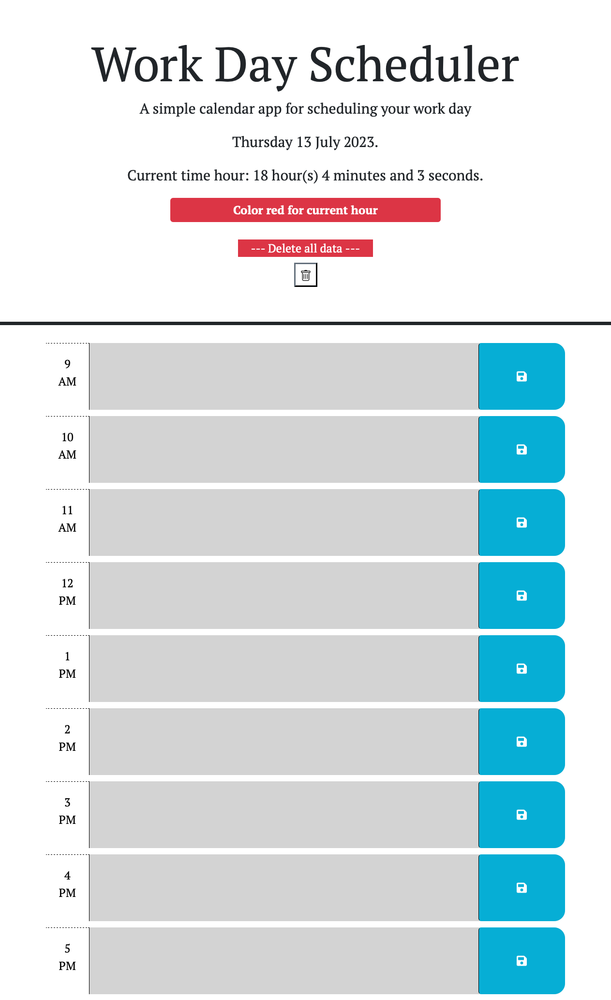

# WorkSchedule - jQuery
In this challenge im working with an existing file and using jQuery to clone, give attributes and save data from the original html file.

## Functionality

To begin the user will be able to see the current hour (red color), the hours that have been completed (color gray) and the next hours (color green).
Each color represents past, present and future. The user may be able to introduce its information into the text area and save it into the local storage if the user doesnt click the save button the information will not be stored. Once the information is saved it will appear even if the page was reloaded.
On the top theres a button to delete all the information.

## User Story

AS AN employee with a busy schedule
I WANT to add important events to a daily planner
SO THAT I can manage my time effectively

## Acceptance Criteria

GIVEN I am using a daily planner to create a schedule
WHEN I open the planner
THEN the current day is displayed at the top of the calendar
WHEN I scroll down
THEN I am presented with timeblocks for standard business hours of 9am to 5pm
WHEN I view the timeblocks for that day
THEN each timeblock is color coded to indicate whether it is in the past, present, or future
WHEN I click into a timeblock
THEN I can enter an event
WHEN I click the save button for that timeblock
THEN the text for that event is saved in local storage
WHEN I refresh the page

##Page SS

##Deployed Webpage
https://jonathanlunabiom.github.io/WorkScheduler/